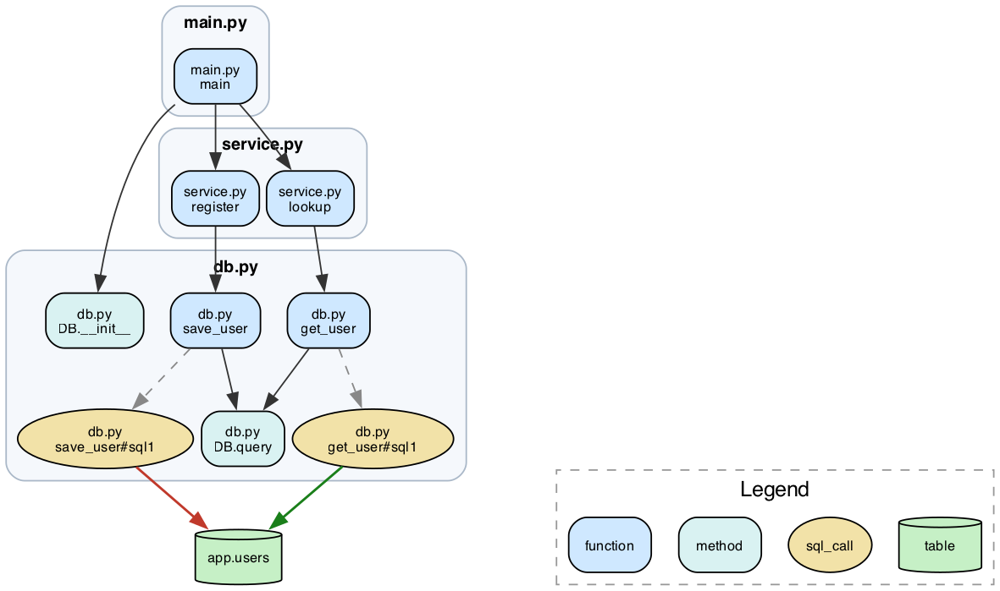

# code-viz

Turn a codebase into a **deterministic, diffable, interactive graph** of how it actually works — every function linked to the functions it calls and the database tables it reads and writes.

`code-viz` statically analyzes a repo into a canonical IR (intermediate representation), then renders it as an interactive graph you can pan, zoom, search, and **collapse pathway-by-pathway**.



## What it does

- **Call graph** — every function/method → the functions it calls, resolved across files (via [Joern](https://joern.io)'s Code Property Graph, with optional SCIP-grade resolution).
- **Data access** — every function → the SQL tables it `reads`/`writes`, covering raw SQL (`cursor.execute`, `sqlalchemy.text`), pandas (`read_sql`), custom DB wrappers, and **SQLAlchemy ORM** (`session.add(Model())`, `select(Model)`) resolved to tables via `__tablename__`. SQL parsed with [SQLGlot](https://github.com/tobymao/sqlglot).
- **One canonical IR** — a sorted, stable-id, timestamp-free JSON. Same code → byte-identical IR, so it's **diffable** and **git-storable**.

## Views

| command | view |
|---|---|
| `codeviz view <repo>`  | **Interactive Cytoscape graph** (default) — dagre DAG layout, pan/zoom, click-to-collapse a node's downstream pathway or a whole module, search, edge-kind toggles |
| `codeviz static <repo>`| Graphviz two-tier HTML — pipeline overview (module rollup, one DAG per weakly-connected component) + full detail, pan/zoom |
| `codeviz diff <repo> <refA> <refB>` | **Interactive Cytoscape diff** of two git commits — added (green) / removed (red) / unchanged (grey), with collapse/search + "changed only" filter, plus a changelog |
| `codeviz neo4j <repo>` | Neo4j loader + Cypher query pack (blast-radius, call-chains, table-writers) |
| `codeviz ir <repo> <out.ir.json>` | Just build the canonical IR |

A `<repo>` arg is a source directory (IR built on the fly); an `*.ir.json` arg uses a prebuilt IR (fast path).

## Quickstart

```bash
# prerequisites: uv, graphviz, and joern (brew install graphviz joern)
git clone https://github.com/AlexYoussef/code-viz && cd code-viz
./codeviz view examples/toyapp        # builds the IR and opens the interactive graph
```

The interactive graph: **scroll = zoom, drag = pan, click a node** to collapse its exclusive downstream pathway (click again to expand), **click a module box** to fold the whole file. Green edges = table reads, red = writes, grey = calls.

## How it works

```
repo ──▶ Joern CPG ─┐
                     ├──▶ canonical IR (nodes: fn/method/sql_call/table ; edges: calls/reads/writes)
repo ──▶ AST + SQLGlot ─┘        │
   (SQL string / pandas /        ├──▶ cyto.py   → interactive Cytoscape graph   (default)
    ORM Model→__tablename__)     ├──▶ ir_to_dot → Graphviz overview + detail
                                 ├──▶ diff_ir   → colored git-diff graph
                                 └──▶ ir_to_cypher → Neo4j + query pack
```

The IR is the single source of truth; every view is a pure projection of it. Because the IR is canonical and deterministic, a snapshot is just a committed `ir.json`, and diffing two commits is a set-difference of nodes and edges.

## Layout

- `codeviz` — the CLI.
- `extract/` — IR builders: `export.sc` (Joern export), `emit_ir.py` (calls + DB access → IR), `codeviz.py` (extraction engine).
- `viz/` — renderers: `cyto.py` (interactive, default), `ir_to_dot.py` (Graphviz), `ir_to_cypher.py` (Neo4j), `diff_ir.py`, `build_ir.sh`, `codeviz-git.sh`; `vendor/` holds the vendored Cytoscape libs (offline, no CDN).
- `examples/toyapp/` — a tiny sample repo to try it on.

## Status

Prototype. Python is the most-tested language; Joern's frontends cover Java, JS/TS, Kotlin, PHP, Go, C/C++, and more. The database layer currently targets Python (raw SQL, pandas, SQLAlchemy ORM). Contributions welcome.

## License

MIT — see [LICENSE](LICENSE).
